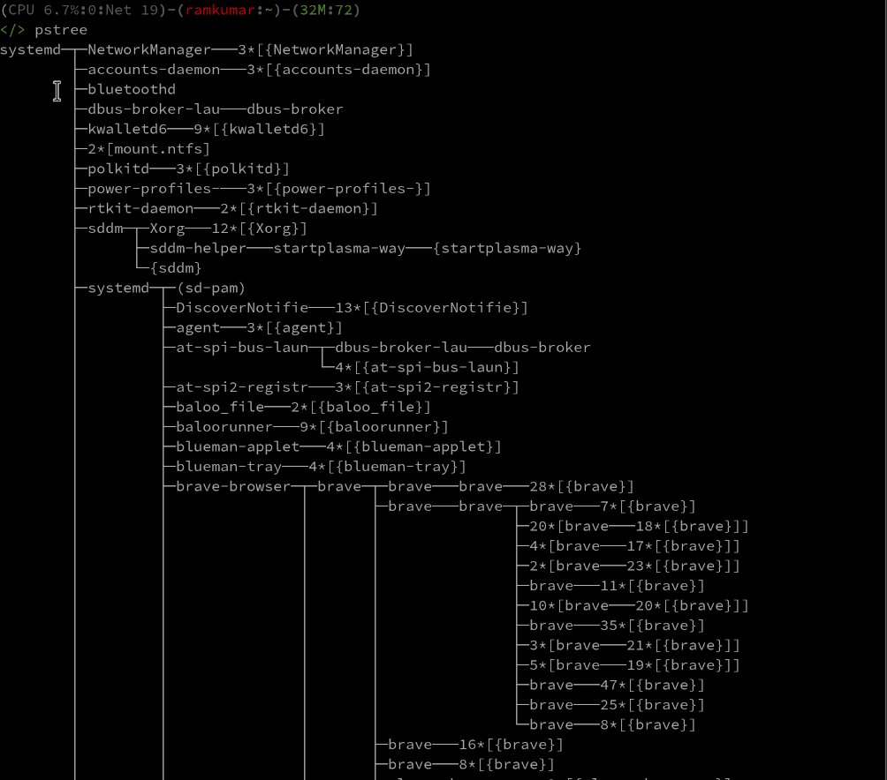
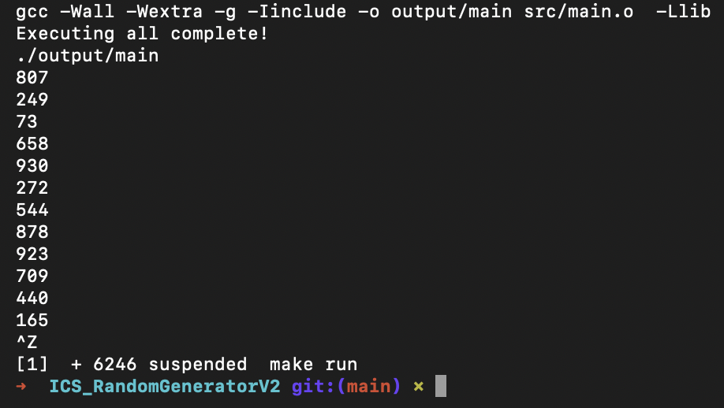
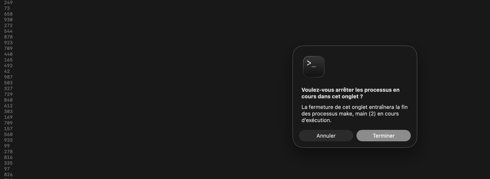
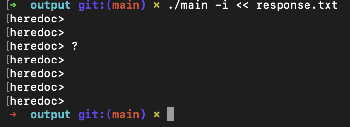
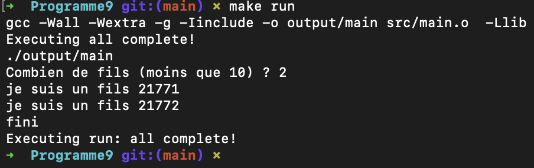
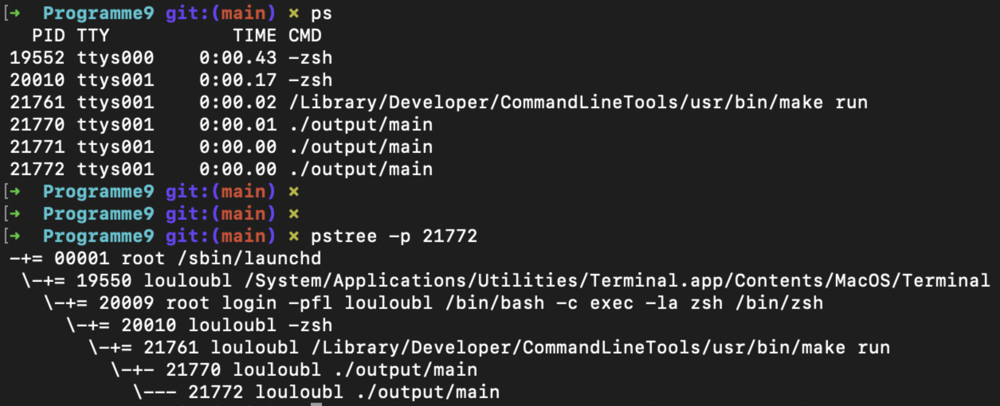
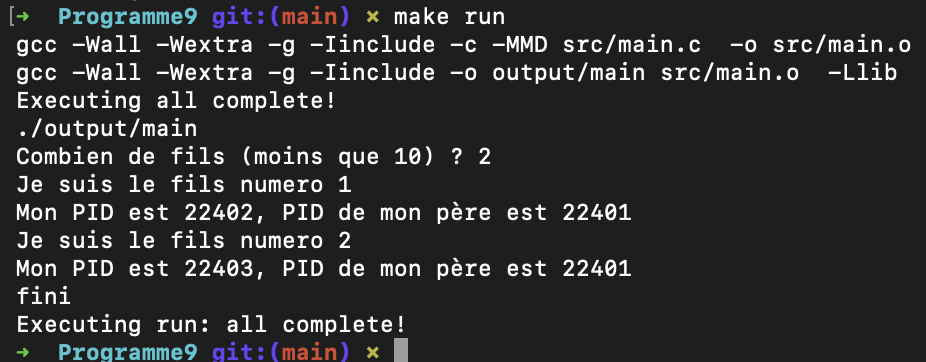
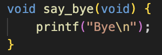
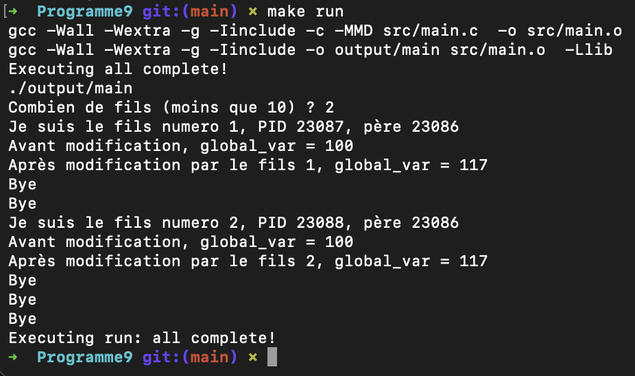
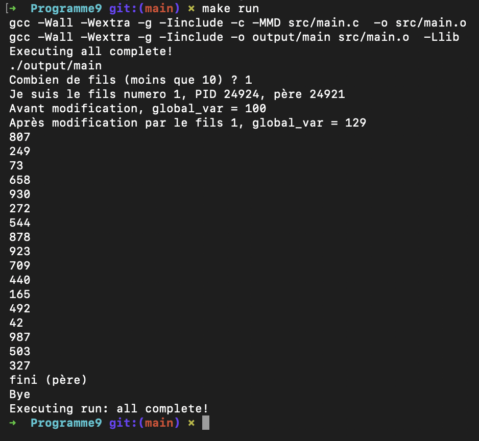

## 5. Commandes de base

<br>

**[5A] Quel est le rôle des commandes suivantes ?** <br>
- ps
Est une commande qui a pour but de voir quels sont les processus qui tournent sur la machine.

- pstree
Elle sert a afficher les processus en cours, sous forme d'arbre...
ex trouvé sur internet : 
<br>

- kill
Permet d'arreter un processus en cours, doit prendre en parametre l'id du processus en cours.


<br><br>

**[5B] Tapez la commande ps -aux. Quelle est son utilité ? A quoi correspondent les colonnes :**<br>
L'utilité de la commande est de savoir quels sont les processus qui tournent a l'instant I dans le systeme, voir les statistiques du CPU, de la mémoire,...

- USER, permet d'identifier l'user auquel apartient le processus
- PID, Un numéro de PID est unique dans le système : il est impossible que deux processus aient un même PID au même moment
- %CPU, donne le % qu'occupe le processus en utilisation du CPU
- %MEM, donne le % qu'occupe le processus en utilisation de la memoire RAM
- VSZ, memoire virtuelle qui est utilisée (VSZ = Virtual Memory Size)
- RSS, memoire physique réelement utilisée (RSS = Resident Set Size)
- TTY, terminal qui est lié a un processus en cours (? si auccun lui est attribué)
- STAT, indique l'etat actuel du processus
- START, donne la date et l'heure du lancement du processus
- TIME', le temps ou le CPU a été utilisé depuis la creation du processus

<br><br>

**[5C] La commande top ou htop affiche une colonne PR et NI. A quoi correspondent les deux colonnes ? Quelle est la différence entre PR et NI ?**<br>
Les deux sont liés a la priorité d'execution des processus. NI (Nice value) indique la valeur de politesse définie par l’utilisateur, allant de -20 (priorité élevée) à +19 (priorité faible). PR (Priority) représente la priorité réelle attribuée par le système d’exploitation pour déterminer l’ordre d’exécution des processus : plus la valeur est basse, plus le processus est prioritaire.
<br><br>

**[5D] Quelle commande permet d’afficher la priorité d’un processus ?**<br>
La commande est ps -l

<br><br>

**[5E] Quelle commande permet de changer la priorité d’un processus ?**<br>
Il faut utiliser RENICE, ça change la priorité (nice value) du processus


<br><br>

**[5F] Quelle est la différence entre kill -3 et kill -9 ? A quoi correspondent les options -3 et -9 ? Donnez la liste des principaux signaux ( valeur numérique, nom, rôle)**<br>
kill -3 sert à arreter le processus proprement (utilise SIGQUIT)
<br>
kill -9 sert a forcer un processus a s'arreter brusquement (utilise SIGKILL)


<br><br>

**[5G] Quelle est la particularité du signal SIGKILL ?**<br>
Simplement qu'il est dit interceptable, il est impossible pour un processus de l'intercepter, de l'igniorer ou de le bloquer... 


<br><br>


**[5H] Quel est le rôle de la commande nohup ?**<br>
D'apres ce que j'ai compris c'est une commande qui permet de faire en sortes que le processus continue meme apres que l'user ait fermé le terminal sur lequel il était. Et aussi meme si celui ci se déconnecte de sa cession.


<br><br>


**[5I] Quelles commandes vous permettent de passer un processus en arrière plan ? De le ramener en avant plan ? De le mettre en pause ?**<br>
Pour passer en arriere plan des processus il suffit de rajouter esperluette & à la fin de la commande.
Pour le rammener en avant plan il faut utiliser fg
Pour le mettre en pause Ctrl et z

<br><br>


## 6. Gestion des processus⚓︎


**[6A] Il existe deux approches pour passer le processus en « background » (tache de fond). Lesquelles ?**<br>
La premiere serait de faire en sortes que a la fin de la commande soit renseigné &. 
La seconde serait de le suspendre avec Ctrl Z puis de le relancer en arière plan avec bg.

<br><br>

**[6B] Votre processus est en tache de fond ? Tapez la commande « clear » ? Qu’observez-vous ?**<br>
Permet d'avoir un terminal qui est vide et propre, cependant le processus tourne toujours en arriere plan sans perturber mon terminal.

<br><br>

**[6C] Comment pouvez-vous mettre le processus en pause ? Il existe deux approches, lesquelles ?**<br>
Comme vu précedament, Ctrl Z permet de stopper un processus. <br>
Il est aussi possible d'utiliser kill -9 pour stopper le processus en cours radicalement.
<br><br>

**[6D] Que devez-vous faire pour le ramener en « foreground » (en avant plan ?)**<br>
La commande fg avec son "job number" (pour le trouver il suffit de taper jobs (regarde les processus en arriere plan))

<br><br>

**[6E] Que devez-vous faire pour le ramener en « foreground » (avant plan?)**<br>
La commande fg avec son "job number" (pour le trouver il suffit de taper jobs)


<br><br>

**[6F] Que devez-vous faire pour arrêter le processus. Vous avez deux solutions, lesquelles ?**<br>
kill -3 sert à arreter le processus proprement (utilise SIGQUIT)
<br>
kill -9 sert a forcer un processus a s'arreter brusquement (utilise SIGKILL)

<br><br>

**[6G] Quelle est la différence entre un numéro de tache et un numéro de processus.**<br>
Un numéro de tache est en fait le job number, identifie le job dans la session shell en cours
Un numéro de processus lui est le PID. Un numéro de PID est unique dans le système : il est impossible que deux processus aient un même PID au même moment.
<br><br>

**[6H] Lancer le programme en tache de fond depuis un terminal ssh et déconnectez-vous du terminal. Le processus et il actif ? Comment avez-vous vérifié?**<br>
<br>
En plus de la capture d'ecran faite au dessus, voici une commande qui verifie que le processus ne tournes plus : pgrep -l main


<br><br>

**[6I] Comment pouvez-vous lancer un processus qui restera actif même si vous fermez la session ? Il existe au moins deux solutions, lesquelles ?**<br>
Avec cette commande ```nohup ./main &``` je lance le processus, et meme a la fermeture de la session il reste actif.

<br><br>

**[6J] Comment lancer randomgenerator avec une priorité plus faible ?**<br>
Pour lui mettre une priorité faible il suffit d'utiliser NICE et de lui donner une valeur positive.
```nice -n 10 ./main```

<br><br>

**[6K] Quelle commande vous permet de changer la priorité de randomgenerator ?**<br>
Il suffit d'utiliser RENICE. Mais avant de tapper la commande il faut connaitre le PID du processus de randomgenerator. Donc j'ai besoin de faire la commande suivante pour le découvrir : ```pgrep main```. Puis ```renice <valeur> -p <PID```. Ici la valeur est forte plus la priorité est faible, et inversement.


<br><br>


## 7. Redirection de flux

**[7A] Que fait la commande randomgenerator > rands.txt ?**
<br>
Apres avoir fait ./main > rands.txt, il se passe que la sortie de ./main s'enregistre dans le fichier rands.txt. (Il y a que un seul chevron donc si il avait des elements dans le fichier txt alors ils ont été écrasés)

<br><br>

**[7B] Que fait la commande randomgenerator >> rands.txt ?**
<br>
Exactement la meme chose que la première sauf que le double chevrons n'écrase pas le contenu du fichier mais ne fait qu'ajouter a la fin de celui ci les valeurs de ./main

<br><br>

**[7C] Que fait la commande randomgenerator -i ?**
<br>
Permet de renseigner le nombres de valeurs aléatoires que je veux que le programme me dones.

<br><br>

**[7D] Que fait la commande randomgenerator -i <<< "10"**
<br>
Dit au programme le nombre de sorties que l'on souhaites, ici 10, ça m'évites de le taper  moi.

<br><br>

**[7E] Tapez la commande echo "20" > response.txt Que fait-elle ?**
<br>
Elle écrase le contenu du fichier reponse.txt et le remplace par la donnéé 20.

<br><br>

**[7F] Que fait la commande randomgenerator -i << response.txt**
<br>
<br>
Elle me redirige vers HEREDOC, envoie comme entrée standard au programme.

<br><br>

**[7G] Que fait la commande randomgenerator -i <<< "10" | sort -n ?**
 <br> 
Dit au programme le nombre de sorties que l'on souhaites, ici 10, ça m'évites de le taper.
Puis apres le pipe sort -n. trie les sorties dans l'ordre croissant.

<br><br>

**[7H] A quoi correspond les flux 0, 1, 2 (stdin, stdout, stderr) ?**<br>
O correspond a une entrée standard 
1 correspond a une sortie standard
2 correspond a une sortie d'erreur

<br><br>

**[7I] Que fait la commande randomgenerator -i <<< "50" > data.txt &**<br>
La commande exécute le programme en lui donnant l’entrée 50, écrit les différents chiffres dans data.txt, le tout en arrière-plan.

<br><br>

**[7J] Vous devez maintenant avoir un fichier nommé data.txt, que fait la commande**<br>
 cat data.txt | sort -n <br>
Cette commande permet de visualiser le contenu de data.txt tout en le triant de façon croissante.
<br><br>

**[7K] Modifier le code source de RandomGenerator pour qu'il accepte**
l'option -n XXX, XXX étant le nombre de valeurs aléatoires désirées, et donnez le code.<br>

````c
int main(int argc, char** argv) {
    char oc;
    int repet = -1;

    if (argc > 1 && argv[1][0] == '-' && argv[1][1] == 'n' && argc > 2) {
        repet = atoi(argv[2]);
    } else {
        while ((oc = getopt(argc, argv, "ia")) != -1) {
            switch (oc) {
                case 'a':
                    printf("boummm \n");
                    break;
                case 'i':
                    printf("nombre de valeur : ");
                    scanf("%i", &repet);
                    break;
            }
        }
    }

    while (repet-- != 0) {
        printf("%d\n", rand()%1000);
        usleep(500000);
    }
    return (EXIT_SUCCESS);
}
````
(atoi() convertit une chaîne (argv[2]) en entier.)
(Vérifie manuellement si le premier argument est -n)

<br><br>


## 8. Création d'un processus en C
<br>

La commande fork() permet de "forker" (cloner) le processus courant.
<br>

**[8A] Quel intérêt a un processus de se 'forké' ? Dans quel TD précédent un processus est-il « forké » ? Pour qu'elles raisons ?**<br>
La commande fork() permet de "forker" (cloner) le processus courant.
Le fork permet d'avoir un second processus qui est le meme que celui initiale. Et ça permet de faire un autre traitement sur ce dit processus, faire différentes actions.
<br><br>

**[8B] Quelles sont les particularités d'un processus « forké »**<br>
Les particularités d'un processus qui a été forké est que c'est une copie d'un processus (parent donc) mais il devient son propre processus, donc il a tout qui diffère du parent. Mémoire dédiée, PID, ...
<br><br>

**[8C] Quelle différence existe il entre un processus « forké » et un thread ?**<br>
Un processus forké a comme on a pu le dire sa propre mémoire.
Un thread est lui en colocation d'espace mémoire avec celui du parent, il n'as pas le sien.
<br><br>

**[8D] Quelle est l'une des limites de l'utilisation de fork() ?**<br>
Comme fork() copie entièrement le processus parent, il occupe le même espace mémoire. Et si le parent est volumineux, le processus enfant peut rapidement manquer d’espace mémoire, ce qui peut etre une grosse limite pour le processus enfant au court/moyen/long terme.
<br><br>

**[8E] Quels problèmes peuvent poser les threads ?**<br>
L'un des problèmes est que il partage le meme espace mémoire que le processus parent, donc les memes ressources que le processus principal... Si il y a une erreur dasn l'execution d'un thread, tout le processus peut planter. J'ai cru voir aussi qu'il y avait souvent des problèmes de syncronisations, avec un probleme de ressources partagées causant des instabilités...
<br><br>


## 9. Utilisation de fork, wait, waitpid, sleep
<br>
Ecrire un programme avec un processus père qui lance n processus fils, le nombre n étant saisi au clavier. On vérifiera lors de la saisie que le nombre n est inférieur à 10. Chaque processus fils devra attendre un nombre aléatoire de secondes, compris entre 10 et 120, avant d'afficher :<br>
"je suis un fils 17256"<br>

<br>

**[9A] Que donnent les commandes ps et pstree pendant l’exécution du programme ?**<br>
 <br>
------------------------------------
------------------------------------
<br>

ps affiche les processus du programme séparéments ainsi que leurs PID. Le processus père est celui qui a le PID : 21770, il a été lancé par le make. Les processus fils (2) sont les deux derniers processus que la commande affiche : 21771 et 21772 visibles par ./output/main
<br><br>
pstree fait en sortes que dans la commande que j'ai faites (qui spécifie le PID d'un processus enfant 21772) nous montres l'arbre dont fait parti le processus enfant de la commande. Il affiche le père du processus, son grand père, son arrière grand père, etc ...
<br>

**[9B] Observez l’état des processus.Que se passe-t-il ? Corriger le code du processus père pour que les processus se terminent correctement.**<br>
Observation des processus : Les fils apparaissent dans ps et pstree même après avoir affiché leur message parce que le père n’attend pas leurs retours.
Les fils terminés restent en mémoire comme des processus zombies jusqu’à ce que le père fasse wait().
<br>
Ce qu’il se passe : Chaque fils termine son travail (printf() puis exit(0)), mais le père continue sans les attendre, ils restent attachés au père et visibles comme zombies.

Correction : Le père doit faire une boucle wait() pour récupérer tous ses fils et éviter les zombies. Chaque fils doit terminer avec exit(0) pour éviter de retourner dans la boucle de création de fils.

Dans le code Programme9.c j'avais simplement mis "return(0)" au lieu de "exit(0)" puis "return(0)".
La seule différence entre avec et sans wait c'est au niveau des printf qui s'affichent tous ensemble sans et un à un avec.

```c
for (int i = 0; i < n; i++) {
    wait(NULL);
}
```

**[9C] Modifiez le code précédent pour que les fils affichent "Je suis le fils numero n ". La valeur de n est le numéro d'ordre de création du fils. Le fils doit aussi affiché sont PID, ainsi que le PID du père.**<br>
<br>
```c
printf("Je suis le fils numero %d, PID %d, père %d\n", i, getpid(), getppid());
```


**[9D] Modifiez le programme précédent pour qu'il y ait toujours le même nombre d'enfants en fonction.**<br>
Je ne comprend pas la question, en fonction de quoi ?

**[9E] Créez une variable globale. Chaque fils devra afficher la variable globale avant de la modifier de façon aléatoire et afficher la nouvelle valeur, juste avant de terminer son activité. Qu'observez-vous ? Est-ce cohérent avec les questions de la partie 6 ?**<br>

Chaque fils affiche la valeur de la variable globale puis la modifie, mais les autres fils et le père ne voient pas ces changements. En fait, chaque fils travaille sur sa propre copie de la variable après le fork.

Oui, ça correspond à ce qu’on a vu avant : chaque processus a sa mémoire séparée, donc ce qu’un fils change dans la variable globale n’affecte pas les autres.
```c
int global_var = 100;  // variable globale initialisée

// Dans chaque fils :
printf("Avant modification, global_var = %d\n", global_var);

int modif = rand() % 50;  // valeur aléatoire
global_var += modif;

printf("Après modification par le fils %d, global_var = %d\n", i, global_var);

```
<br><br>


## 10. Exécution de routines de terminaison
```c
#include <stdlib.h>
int atexit(void (*function) (void));
```
Le paramètre est un pointeur de fonction vers la fonction à exécuter lors de la terminaison. Elle renvoie 0 en cas de réussite ou -1 sinon.<br>

**[10A] Modifiez le programme précédent pour que les processus affichent "Bye" en utilisant une fonction de terminaison.**<br>
<br>
J’ai utilisé atexit() pour que chaque processus affiche "Bye" à la fin.
Dans le terminal, on voit que les fils et le père affichent "Bye" à leur sortie.
Parfois "Bye" apparaît plusieurs fois pour un même fils ou pour le père (comme dans ma sortie : deux "Bye" pour chaque fils et trois pour le père).
C’est normal, ça vient du fait que plusieurs processus écrivent en même temps dans le terminal et à cause du buffering de stdout.
Chaque processus appelle quand même bien la fonction une seule fois, c’est juste l’affichage qui se mélange.<br>

```c
void say_bye(void) {
    printf("Bye\n");
}
```
```c
// Pour le père 
atexit(say_bye);

// Pour chaque fils
atexit(say_bye);
```

## 11. Exécution de programme externe : exec<br>

**[11A] Modifiez le programme précédent pour que chaque processus fils lance l’exécution du programme randomgenerator avec un nombre de valeur comprise entre 10 et 20. (i.e. randomgenerator -n 15 )**<br>
Chaque fils doit lancer le programme randomgenerator avec un nombre de valeurs entre 10 et 20. Du coup, dans le fils, on génère un nombre au pif entre 10 et 20 et on fait un execlp pour lancer le programme à la place du code du fils. Si ça rate, on affiche une erreur et on sort.

voici les modifs faites dans le code : 
```c
            // EXÉCUTION DE RANDOMGENERATOR
            int nb = 10 + rand() % 11; // nombre aléatoire entre 10 et 20
            char str_nb[4];
            sprintf(str_nb, "%d", nb);

            execl("../ICS_RandomGeneratorV2/output/main", "main", "-n", str_nb, NULL);

            // Si execl échoue
            perror("execl échoué");
            exit(1);
```
Voici ce qui ressort de ce programme. <br>

