# Rendu TP
**T. Rey & L. Brunet-Lecomte Grobon**
  
-----------------------------------
-----------------------------------

## INDEX  

**Vérifiez le nombre de ligne dans chaque table. La base doit contenir 20247 enregistrements dans TITRES, 9706 dans FILM, 5976 dans REALISATEUR et 10245 dans REALISE.** 
- 9706 dans FILM :  
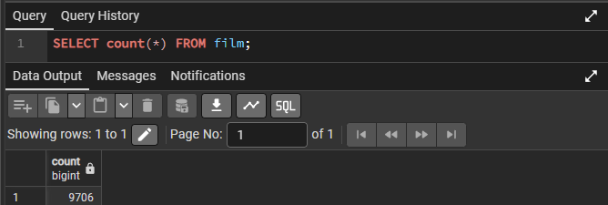 

- 20247 enregistrements dans TITRES  
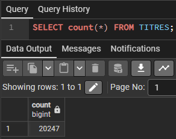 

- 5976 dans REALISATEUR 
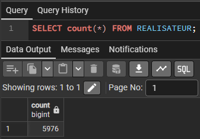 

- 10245 dans REALISE 
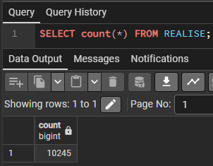  

-----------------------------------
-----------------------------------

## INDEX & EXPLAIN SOUS POSTGRESQL  
**Voici le résultat de ce que nous avons configurés avec l'outil EXPLAIN** 
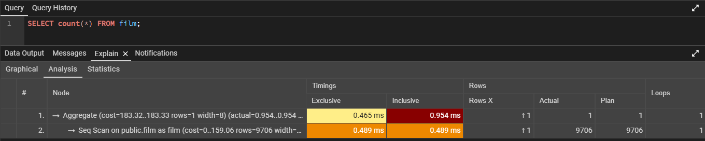  

**REALISATION D’UN PLAN DE REQUETE** 
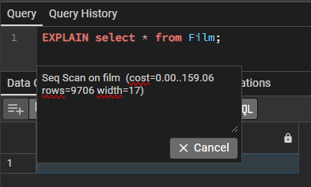  

-----------------------------------
-----------------------------------

## TRAVAIL A REALISER  

-----------------------------------

### A. OBJECTIF & ETAPES A RESPECTER  
 

**1. EXPLAIN SELECT… (à exécuter sur une table sans index)** 

**2. Copier (copie d’écran) ou recopier succinctement le plan d’exécution dans un éditeur et l’expliquer (regarder notamment le coût de la requête et les opérateurs)** 

**3. Création d’un index sur le(s) champ(s)** 
- Sur une FK, créer un INDEX NON UNIQUE : CREATE INDEX IDX_NOMTABLE_NOM_CHAMP ON
TABLE(CHAMP);
- Sur une PK, créer un INDEX UNIQUE (et non une PK même si cela revient au même) : CREATE
UNIQUE INDEX IDX_NOM_TABLE_NOM_CHAMP ON TABLE(CHAMP). 

**4. EXPLAIN SELECT… (sur une table avec index cette fois !)** 

**5. Copier (copie d’écran) ou recopier succinctement le plan d’exécution dans un éditeur et l’expliquer. L’index a t’il rendu la requête plus performante ? Expliquer la différence avec le plan d’exécution obtenu lors des étapes 1 et 2.**  

**6. Les étapes 3 à 5 sont à répéter autant de fois que nécessaire si plusieurs index sont à créer.** 

**7. Supprimer l’index (ou les index) créé(s) (commande DROP INDEX nom_index;). Pour visualiser si les index ont été supprimés, utilisez la vue système pg_indexes : Select * from pg_indexes where schemaname='public'; Cette vue ne doit afficher aucune ligne après suppression des index. Vous pouvez aussi le vérifier graphiquement (penser à rafraichir) :**
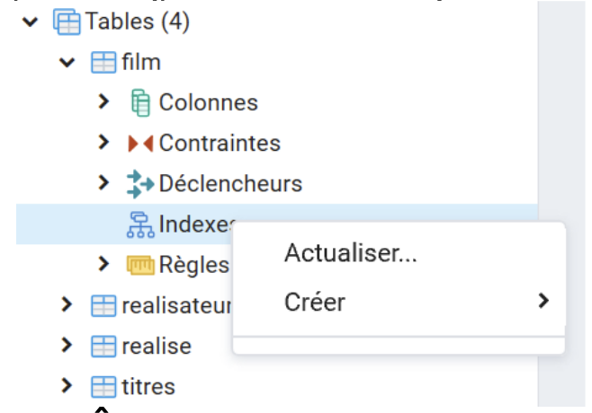 

**8. LORS DU PASSAGE A LA REQUÊTE SUIVANTE, TOUS LES INDEX DOIVENT AVOIR ETE SUPPRIMES.**

-----------------------------------
-----------------------------------

### B. REQUETES

#### 1. SELECT * FROM film WHERE id=5200; 

**Testez sans index.** 
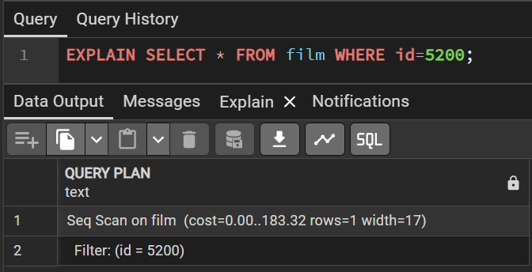 

**Testez après l’ajout d’un index unique sur ID : CREATE UNIQUE INDEX idx_film_id ON film(id);** 
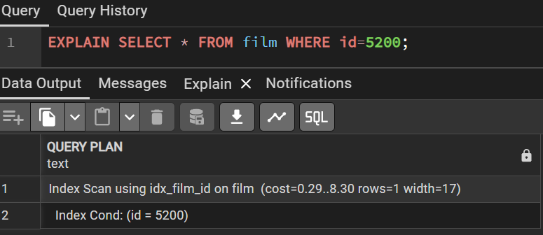 

**Coût de la requête ? Expliquez. Comparez avec les résultats de l’exemple.** 
Après avoir créé l'index, le coût est plus de 20 fois plus petit. L'index, en effet améliore grandement les performances de la requête. 
Par rapport à l'exemple, une différence de performance est observée, car ici, on recherche un contenu spécifique dans la table, où l'index devient ici intéressant, niveau performance, alors que dans l'exemple, lorsqu'on sélectionne toute la table, l'index n'est pas plus efficace.

**Supression de l'index** 

-----------------------------------

#### 2. SELECT * FROM film WHERE id=5200 AND pays ='CH/FR'; 

**Testez sans index.** 
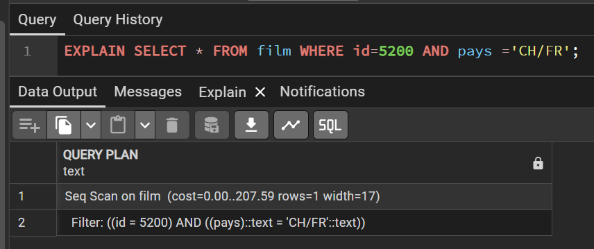 

**Testez après l’ajout d’un index unique sur ID : CREATE UNIQUE INDEX idx_film_id ON film(id);** 
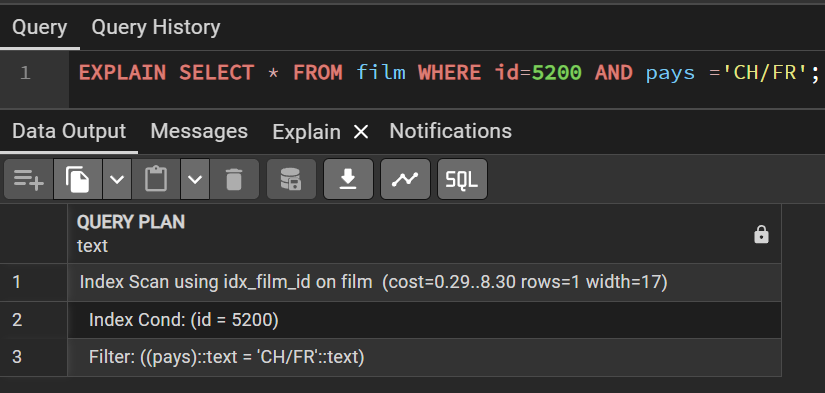 

**Ajoutez ensuite avec un index non unique sur PAYS. Testez. Conclusion ?** 
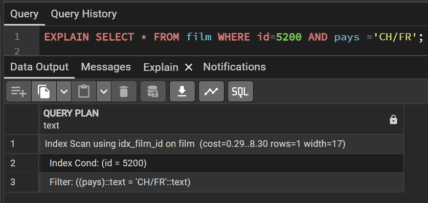 
Malgré la création de l'index non unique pour pays, il n'a pas besoin d'utiliser ce dernier, car id est unique, donc cela lui suffit pour sa recherche. Ainsi, pour les deux, seul l'index de id est utilisé.

**Supression des index** 

-----------------------------------

#### 3. SELECT * FROM film WHERE id=5200 OR pays ='CH/FR'; 

**Testez avant et après l’ajout d’un index unique sur ID. Ajoutez ensuite un index non unique sur PAYS et testez. Remarque : un index bitmap est une alternative à un index B-tree. Ils sont utilisés dans le contexte des entrepôts de données (datawarehouse), proposent un faible coût de stockage, sont rapides pour les opérations de lecture mais peu performants quand les MAJ sont nombreuses. Ici, PostgreSQL utilise ce type d’index et non un B-tree, mais peu importe il s’agit quand même d’un index. Conclusion ? Comparez par rapport aux plans de la question précédente.** 

- Avant :  
Cout de la requete 207
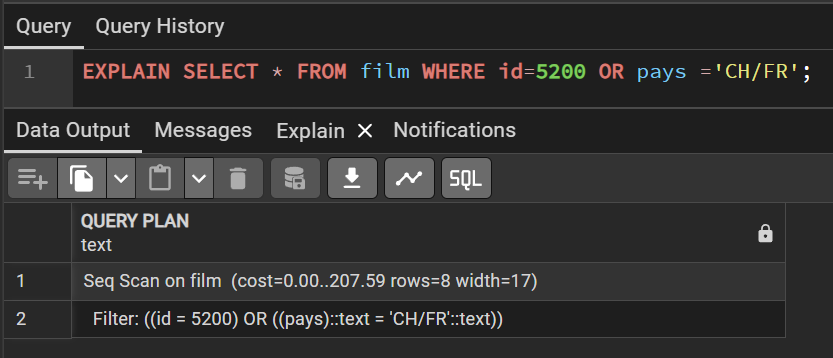 

- Apres :  
Cout de la requete 207, soit le même cout.
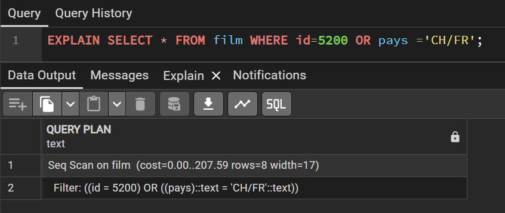 

- Ajout d'un index non unique sur pays :  
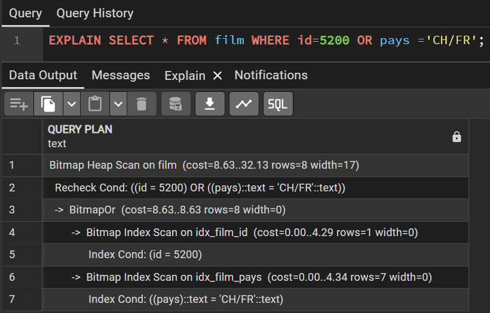 

- Conclusion :  
On observe un changement significatif de cout, au moment lorsque on rajoute l'index non unique sur pays (200 à 32). Cependant, il est le même lorsqu'il n'y a aucun index, et lorsqu'on ajoute l'index unique sur id seulement. En effet, lorsqu'on met juste l'index unique sur id, il peut rechercher plus que rapidement l'id 5200. Cependant, il a aussi besoin d'effectuer une recherche sur toute la table pour le pays CH/FR. Il fait donc un seq scan, ce qui ne change point grand chose. Par contre, grâce à l'ajout de l'index non unique sur pays, cela permet la recherche sur les pays aussi bien plus rapide. La ou cela diffère entre les deux c'est que pour cette question il effectue un bitmap avec les résultats index de l'ID et les résultats de l'index de PAYS.

**Supression des index** 

-----------------------------------

#### 4. SELECT * FROM film WHERE id>2000; 

**Testez avant et après l’ajout d’un index unique sur ID. Coût de la requête ? Expliquer Supprimez l’index.** 
- Avant :  
Cout de la requete 183.32
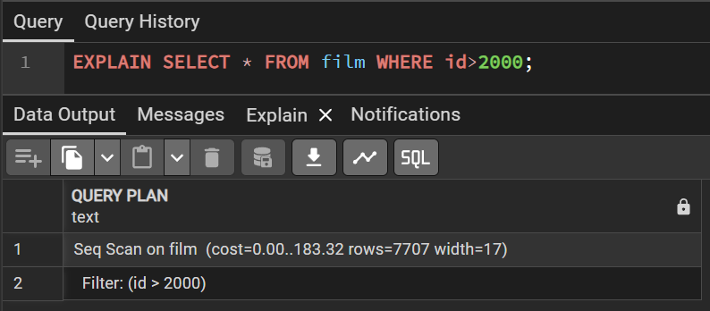 

- Apres :  
Cout de la requete 183.32, soit le même cout.
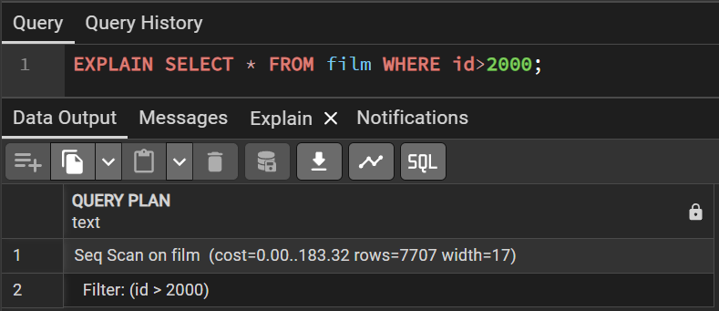 

- Explications :  
En effet le cout de la requete reste le meme car il vas rechercher id>2000, ce qui renvoie beaucoup de résultat, et qui vas faire que la recherche séquencielle est optée.

-----------------------------------

#### 5. SELECT * FROM film WHERE id>8000; 

**Testez seulement après l’ajout d’un index unique sur ID. Expliquer les différences par rapport à la question précédente.** 
- Apres :  
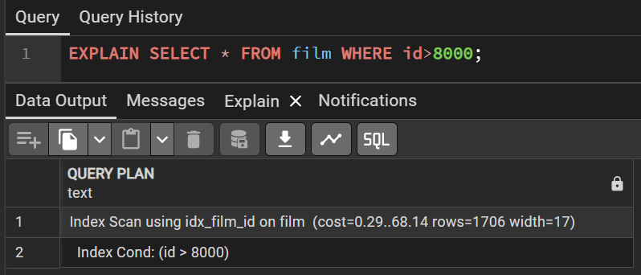 

- Expliquation :  
Ici le parcours par index esteffectué, et il est choisi car la requete renvoie moins de lignes que la requete précédente (id>2OOO x id>8000).

**Supression de l'index** 

-----------------------------------

#### 6. Index multicolonnes (composite) 

**Ajout de l'index sur film(pays, annee)** 

**Testez les plans d’exécution des requêtes suivantes :** 
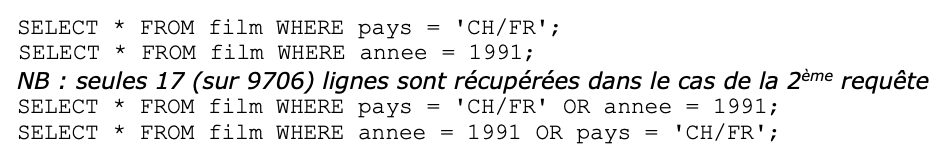 
Requete 1 :  
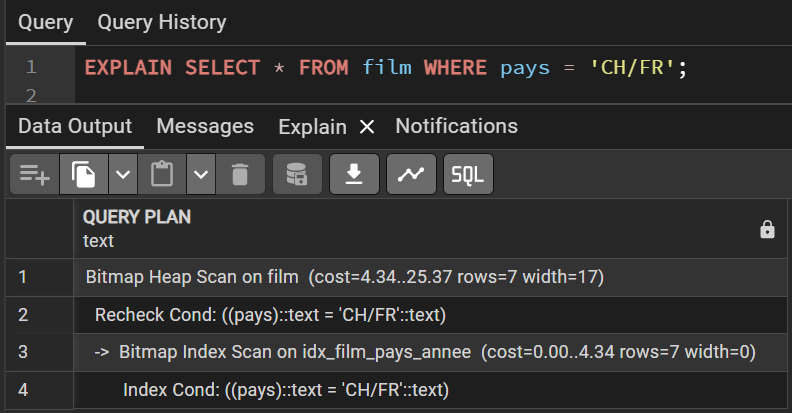 
Requete 2 : 
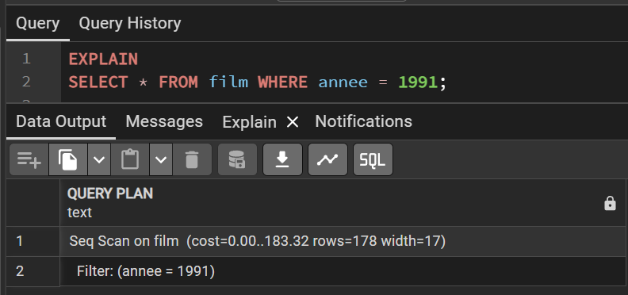 
Requete 3 : 
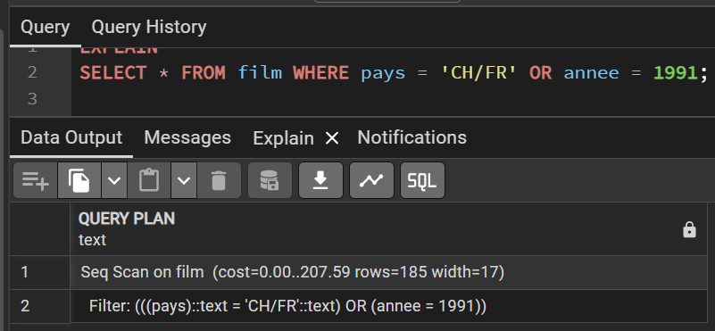 
Requete 4 :  
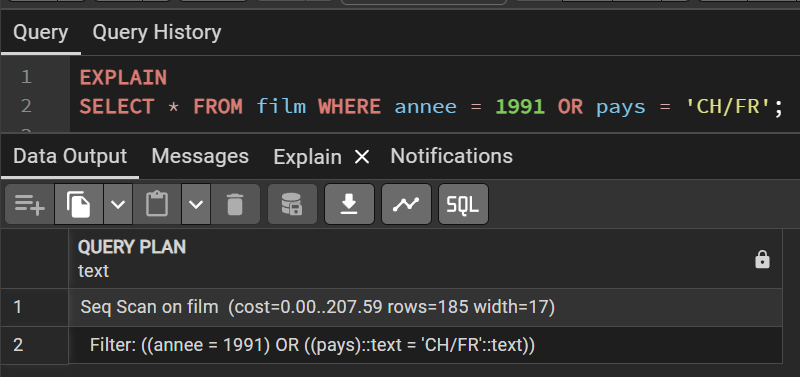 

**Supression de l'index** 

**Ajout de l'index sur film(annee, pays) cette fois (inversion de l’ordre des 2 champs) :** 

**Testez les plans d’exécution des requêtes suivantes :** 
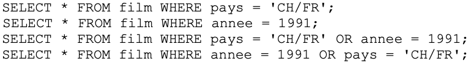 
Requete 1 : 
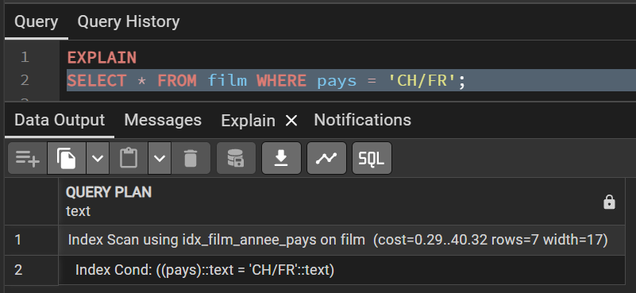 
Requete 2 : 
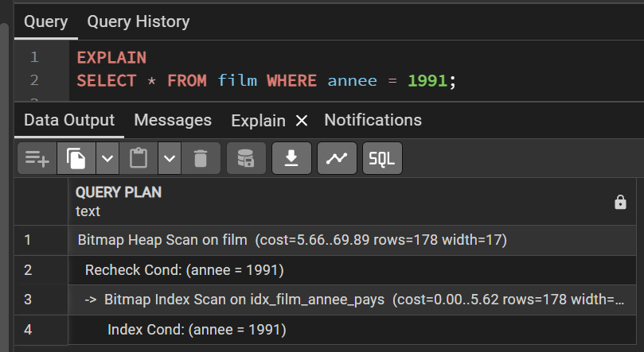 
Requete 3 : 
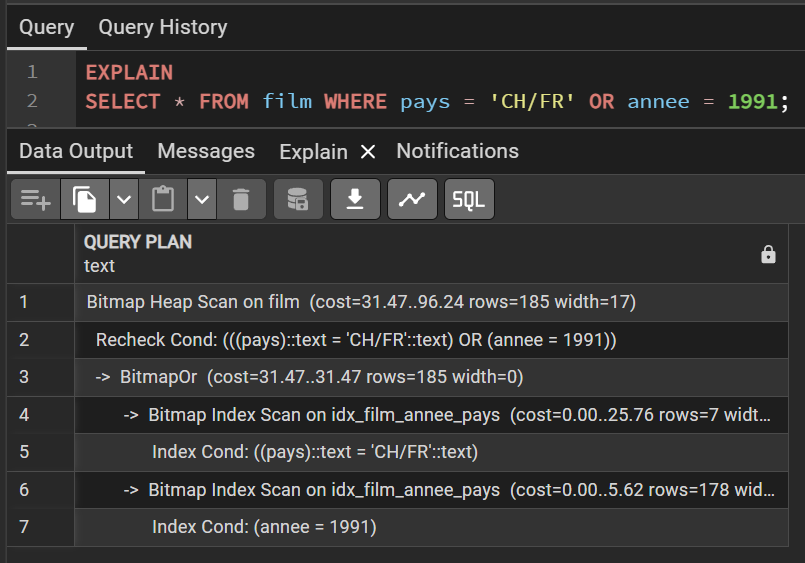 
Requete 4 : 
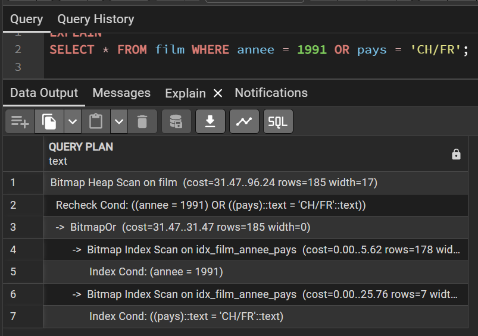 

**Faire une synthèse de ces 2 cas (index sur pays/annee puis annee/pays). Aide ici : https://docs.postgresql.fr/17/indexes-multicolumn.html** 

- Cas 1 :  
Le premier cas s'illustre au travers de 4 requetes.
La première requete utilise bien la recherche par index pour la condition WHERE PAYS =, car il s'agit de la premiere colone définie dans l'index. Cependant pour les autres requetes qui contiennent plus d'une condition dans la requete, il ne parvient pas a utiliser l'index pour cela car dépassé, et fait alors un scan séquentiel. Pour la seconde, le WHERE se fait sur ANNEE qui est la seconde colone de l'index cela ne peut donc pas fonctionner.

- Cas 2 :  
Ce second cas s'illustre au travers des 4 requetes suivantes.
Il parvient a gérer de lui meme correctement en utilisant l'index losqu'il n'y a qu'une seule condition pour le WHERE.  

**Supression de l'index** 

**Création des 2 index monocolonne :** 

**Testez les plans d’exécution des requêtes suivantes :** 
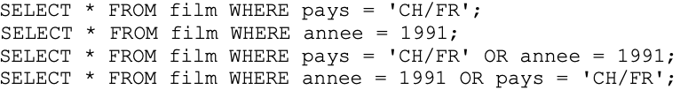 
Requete 1 :  
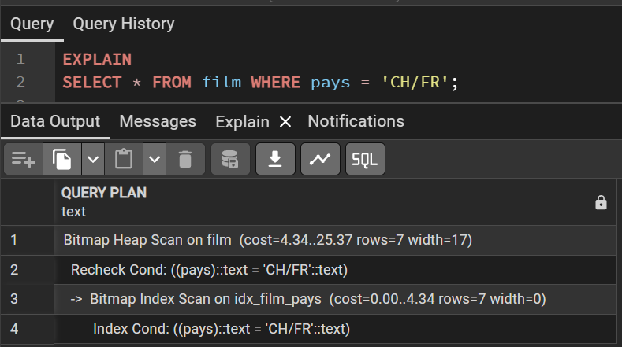 
Requete 2 :  
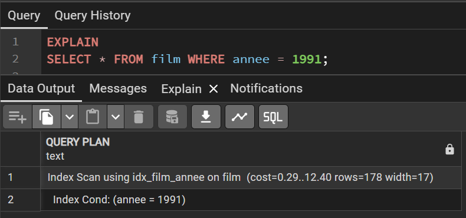 
Requete 3 : 
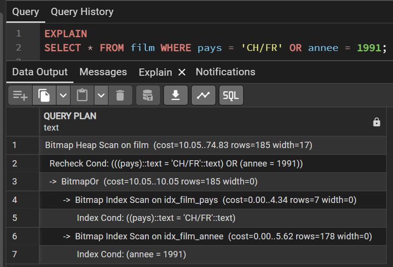 
Requete 4 :  
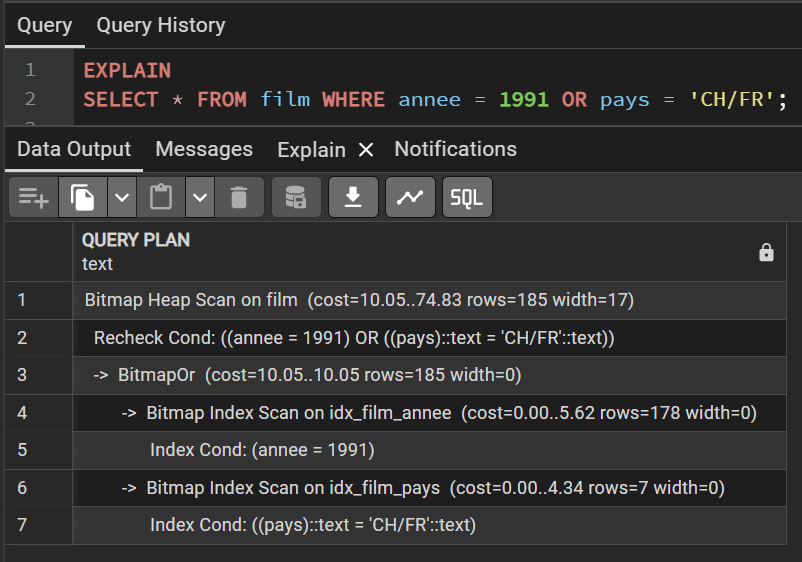 

**Taille des index : Malgré la taille plus réduite d’un index multicolonnes (par rapport à la création de 2 index), son utilisation est-elle pertinente ? Justifiez.** 
Nous avons constaté que PGSQL ne gère pas correctement les index multi colones dans le cadre d'une rechèrche. Son utilisation n'est pas pertinente car le cout reste le meme.

**Supression des index** 

-----------------------------------

#### 7. Index multicolonnes (SUITE) 

**Que préconisez-vous dans de tels cas (sachant en outre que id_real et id_film sont aussi FK) ?** 
Il faut garder l’index composite créé par la Primary Key (pour les recherches sur le couple) et ajouter un index simple sur chaque Foreign Key (id_real et id_film), car l’index composite n’optimise pas bien les recherches sur une seule colonne.

-----------------------------------

#### 8. SELECT * FROM film WHERE SUBSTR(pays,1,2) = 'CH'; 

**Testez après l’ajout d’un index non unique sur nom : CREATE INDEX idx_film_pays ON film(pays);** 
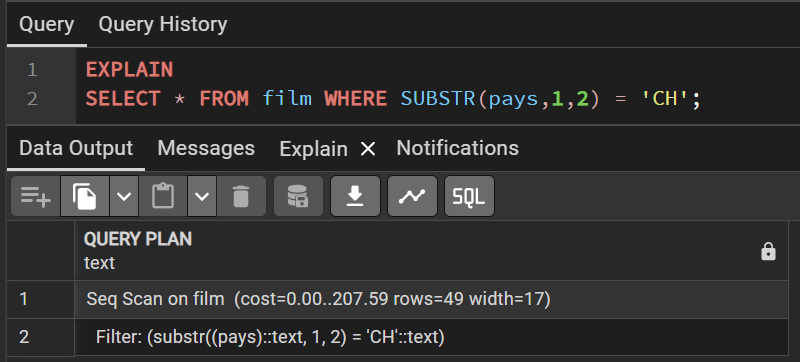 

**Supression de l'index** 

**Essayez ensuite de créer un index sur fonction (Cf. section 11.7. Index sur des expressions de la doc PostgreSQL : https://docs.postgresql.fr/17/indexes-expressional.html). Expliquez.** 
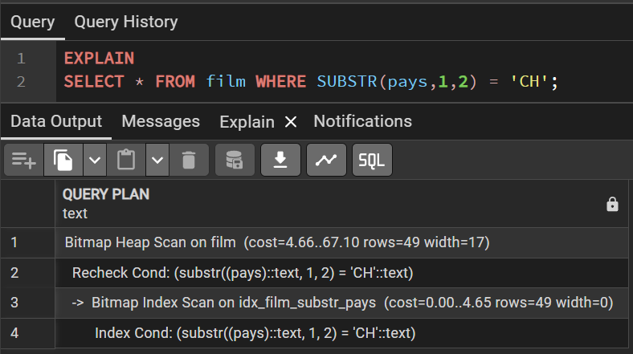 
Pour le premier index qui est sur la colone PAYS il ne peut pas être utilisé par une requete effectuant une opération sur la colone PAYS (substr(pays, 1, 2)). Cependant si on crée un index spécifique à cette opération (deuxième index créé) celui ci vas pouvoir être utilisé par une requete avec cette opération.

**Supression de l'index** 

-----------------------------------

#### 9. SELECT t.id_film, t.titre, t.langue, f.annee, f.pays FROM Film f JOIN Titres t ON f.id = t.id_film; 

**Testez avant et après l’ajout d’un index unique sur ID de Film (car PK). Vous pourrez également afficher l’explain en mode graphique. Y a-t-il des modifications sur le plan d’exécution entre avant et après ?**
- Avant :  
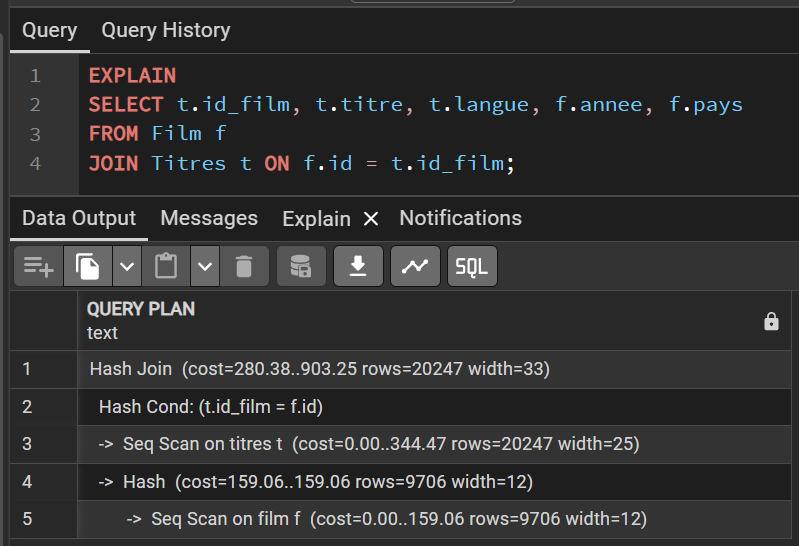 

- Apres :  
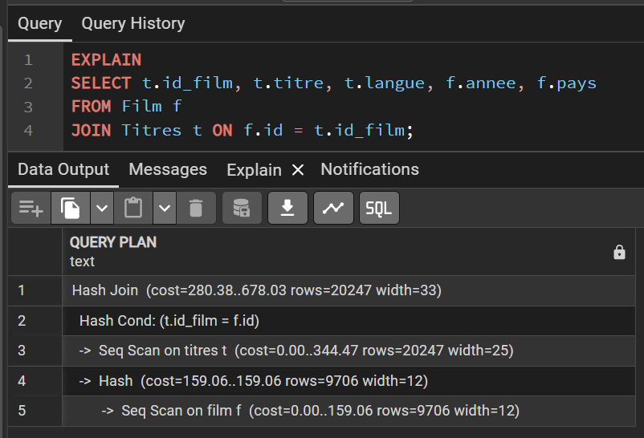 

Il n'y a strictement auccune différence entre les deux plans d'exécution.

**Ajout de l'index non unique sur TITRES(ID_FILM). Y a-t-il des modifications sur le plan d’exécution ? Pensez au volume de données récupérées (et donc aux statistiques).** 
Meme apres avoir ajouté ce nouvel index il n'y a pas de modifications sur le plan d'exécution.

**Supression des index** 

-----------------------------------

#### 10. SELECT t.id_film, t.titre, t.langue, f.annee, f.pays FROM Film f JOIN Titres t ON f.id = t.id_film WHERE f.pays='FR/BE'; 

**Testez sans index. Quelles sont les modifications et pourquoi / à la question précédente sans index (pensez au volume de données récupéré)** 
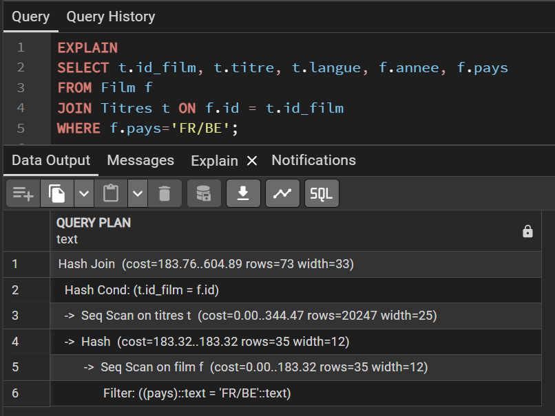  
Les modifications sont qu'actuellement en comparaison a la question précédente, Le cout est spécifiquement plus faible pour le scan séquentiel pour la table film du a la condition sur son attribut PAYS.
Ainsi que un nouvel élément appelé Filter dans le nouvel essai sans index (en comparaison au test fait de la question 9).
Le nombre de titres renvoyés en conséquence est quand a lui réduit à 73 par la condition.

**Le seul index qui devrait être positionné par défaut est celui sur la PK de Film (ID). Ajoutez un index unique puis tester. Quelles sont les modifications et pourquoi ?** 
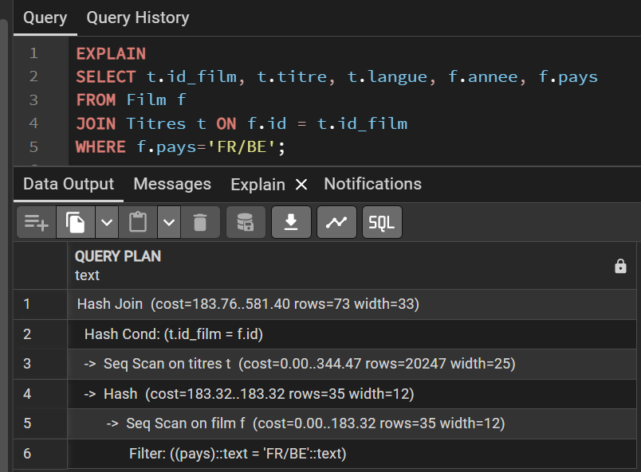 
La modification influe le cout lié au Join entre les deux tables qui est désormais plus faible que précédement sans index (600 -> 580).

**Indexez la condition de recherche (afin toujours d’optimiser l’accès à la table Film). Testez après l’ajout d’un index sur PAYS. Quelles sont les modifications et pourquoi ?** 
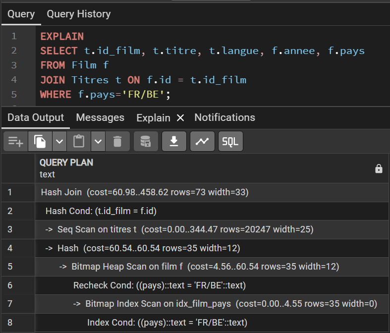 
Ce qui a changé c'est le cout total qui est encore moins long. Il y a une procédure et un bitmap hitscan grace a l'index sur pays que nous avons rajouté.

**Ajoutez un index non unique sur TITRES(ID_FILM). Cette fois un index a été posé sur la 2nde condition de jointure (la clé étrangère), Quelles sont les modifications et pourquoi ? Expliquez sur quels types de champs ont été positionnés ces index (PK, FK, etc.). En déduire un principe d’optimisation (déjà abordé en Q7)** 
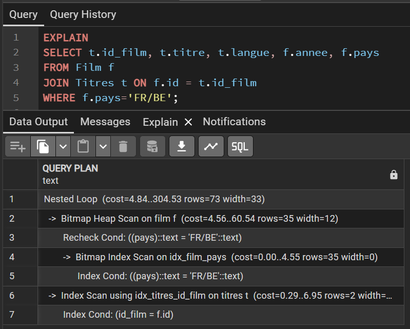 
- Quelles sont les modifications et pourquoi ? :  
Les modifications sont un temps d'execution globale plus rapide avec un cout de 304. Et la procédure est différente, il utilise des index scans pour le PAYS et l'id FILM de TITRE. Ces modifications sont faites car il y a une optimisation, avec un index sur chaque partie de la jointure et aussi un autre sur la condition.

- Ces indexs ont ete posés sur une clé primaire et une clé étrangère, ainsi qu'un champ banale dans une table. Les principes d'otptimisation est d'indexer les clés primaires étrangères et colones uilisées dans la recherche car elles sont les colones les plus efficaces pour réduire le nombres de données a parcourir.

**Supression des index** 

-----------------------------------

#### 11. CREATE OR REPLACE VIEW films1995 AS SELECT id, annee FROM film WHERE annee = 1995; 

**Visualisez l’EXPLAIN sur le SELECT précédent (pas besoin d’ajouter des index). Que constatez-vous et que préconisez-vous ?** 
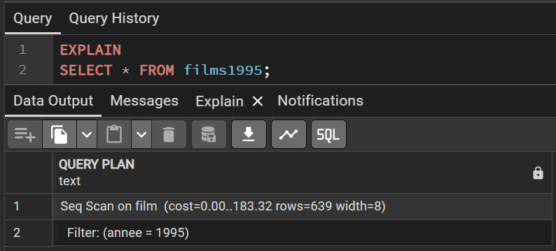 
Elle effectue un select sur la table film et non sur la vue. Ce qui rend la requete couteuse. On préconise de mettre un index sur année pour que la recherche se limites bien aux films de 1995.

-----------------------------------

#### 12.   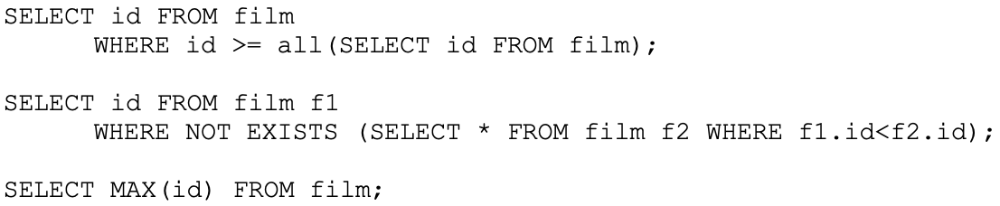 

**Ces 3 requêtes donnent le même résultat. SANS INDEX. Vérifier le coût de chaque requête. Classer par ordre d’efficacité** 
Requete 1 :  
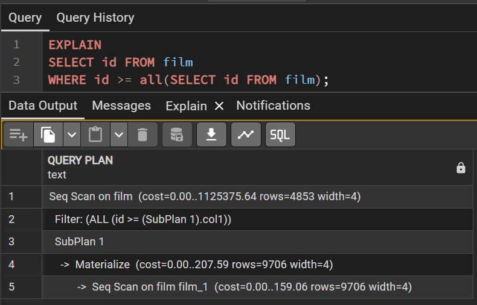 
Requete 2 : 
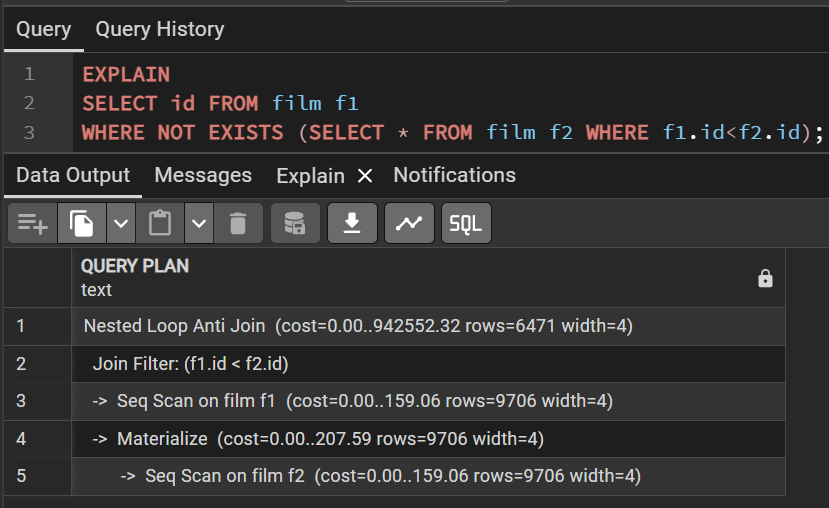 
Requete 3 :  
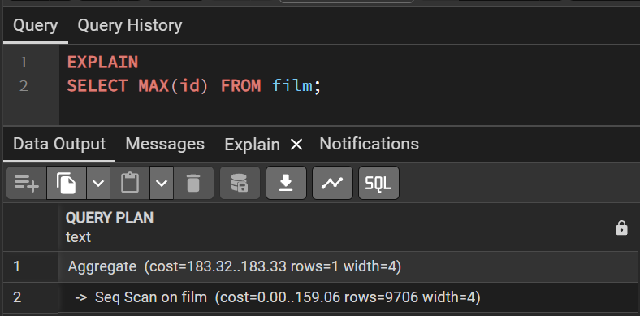 

Le classement en fonction de la plus efficace est basé pour notre part sur leurs couts. La première est bonne dèrnière des trois a cause de son cout (1125375). La seconde est quand a elle seconde du classement avec un cout de 942552. Et la troisième est quand a elle première du classement avec un cout de 183.

-----------------------------------

#### 13. Les 3 requêtes suivantes répondent à la question "Quels sont les réalisateurs (numéros) qui n'ont jamais réalisé de film ?" : 
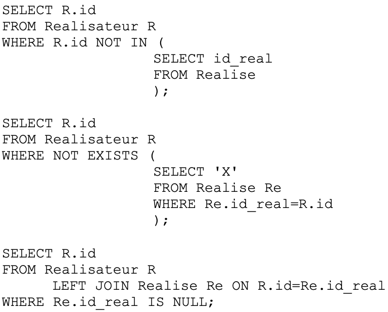 

**a. Quels sont les plans d’exécution de ces requêtes (sans index) ? Laquelle est la moins coûteuse ?** 
Plan d'exécution de la requete 1 :  
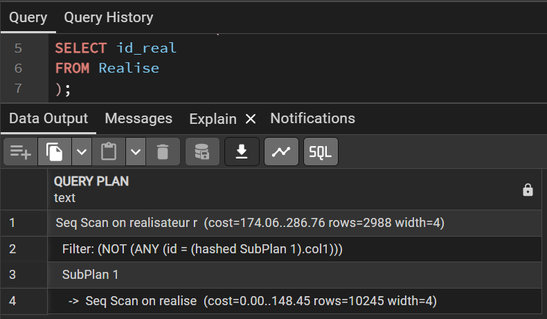 
Plan d'exécution de la requete 2 :  
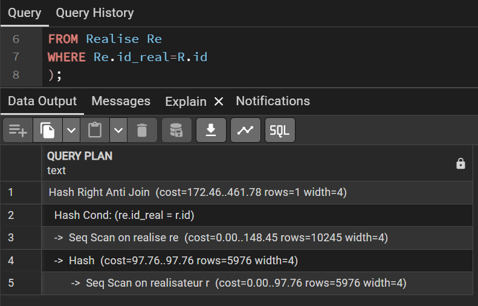 
Plan d'exécution de la requete 3 :  
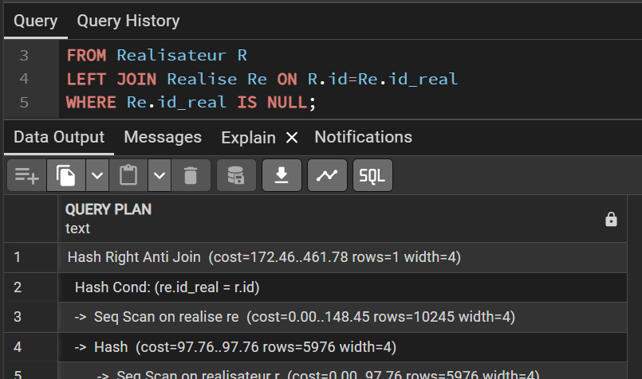 

Celle qui est la moins couteuse est la première (286)

**b. Sachant que sous Oracle 11g et versions supérieures, les 3 requêtes ont exactement le même coût (et le même plan d’exécution) et que sous Oracle 10g, EXISTS et OUTER JOIN ont pratiquement le même plan d’exécution et sont beaucoup plus performants que IN, qu’en déduire globalement (notamment quand on migre de version d’un même SGBD ou que l’on change de SGBD) ?** 
Les requêtes peuvent devenir plus lentes ou plus rapides selon la version ou le SGBD, donc il faut toujours vérifier après un changement.

**c. Ces requêtes sont-elles optimisables via des index ? Combien et lesquels ?** 
Elles sont optimisables en mettant un index sur Realise.id_real sur Realisateur.id ce qui fait deux index.

-----------------------------------

#### 14.   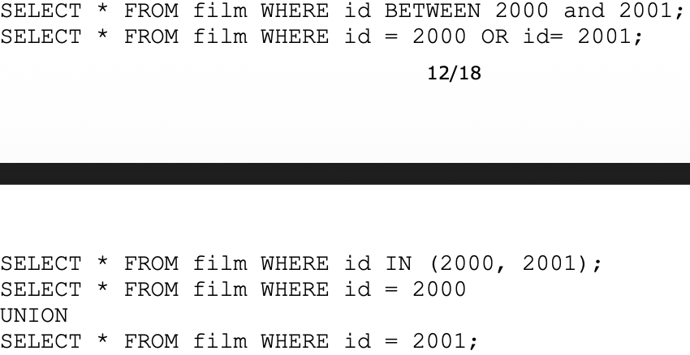 

**Quelle requête est la plus performante (tester sans index) ? Qu’en déduire ? Remarque : sous Oracle, les 3 premières requêtes ont exactement le même coût.** 
Requete 3 cout de 183, elle est donc la plus performante. Ainsi une condition where qui verifie l'égalité dans une liste d'éléments est la plus optimisée.

-----------------------------------

#### 15. Opérateur relationnel de « Division » : afficher les réalisateurs qui ont réalisé tous les films. 
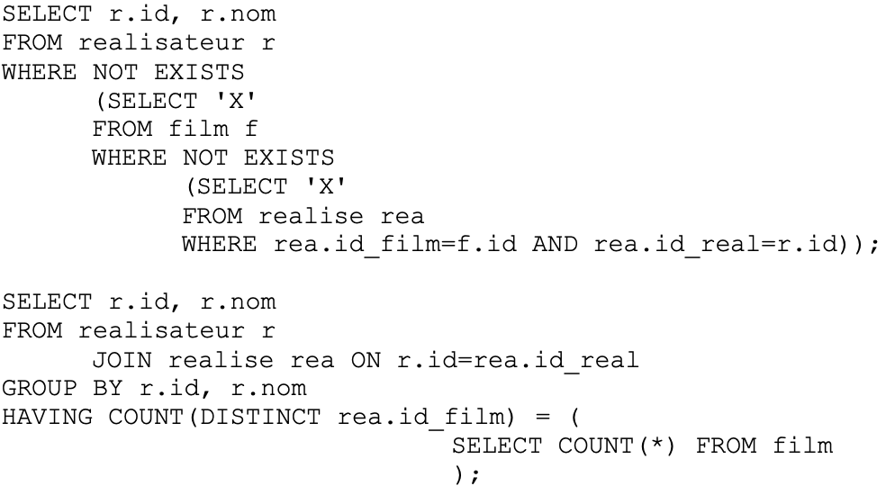 

**SANS INDEX. Vérifier le coût de chaque requête.** 

**REALISER ENSUITE UNE SYNTHESE GLOBALE DES PRINCIPES QUE VOUS POUVEZ TIRER DE CES QUELQUES ESSAIS IMPOSES ET EVENTUELLEMENT DE VOS PROPRES TESTS :** 
- Synthèse Indexation : sur quels champs faut-il mettre des index ? Quelles conditions pour utiliser les index ? Faut-il créer des index mono-colonne ou multi-colonnes ? etc. 
Les champs sur lesquels il faut mettre les index sont les clés primaires et ou étrangères utilisées dans la requete ainsi que les champs utilisés dans les conditions de la requete (de préférence losque ce sont des requetes qui sont faites souvent). De plus il est préférable de faire du monocolone nottament sur PGSQL qui a du mal a gérer ce principe.

- Synthèse optimisation de requêtes : quel type de requête est préférable ? Quel impact si on change de version d'un même SGBD ou si l'on change de SGBD ? etc. 
Condition WHERE dans une liste d'éléments est préférable, de plus si on change de SGBD les perfs peuvent varier il faut donc toujours agir en conséquence pour les index et les types de requete.

