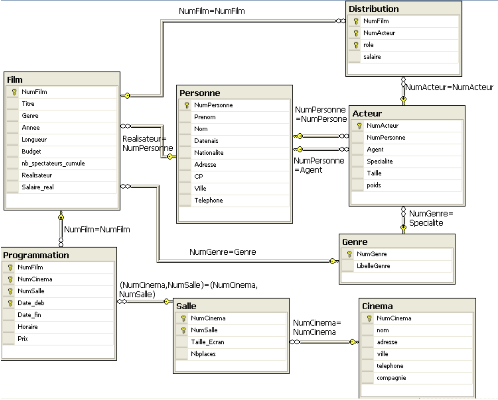

## Exercice 1

1. Quels enregistrements sont insérés après avoir exécuté les commandes suivantes :
```sql
Insert into dept (deptno, dname) values (1, 'Service1');
Insert into dept (deptno, dname) values (2, 'Service2');
COMMIT;
```
explications : les enregistrements qui ont été enregistrés sont Service1 et Service2.

2. Quels enregistrements sont insérés après avoir exécuté les commandes suivantes :
```sql
Insert into dept (deptno, dname) values (3, 'Service3');
Insert into dept (deptno, dname) values (4, 'Service4');
ROLLBACK;
```
Expliquer : Service 3 et 4 et revenir a l'état du dernier commit. soit celui de Service 1 et 2


3. Quels enregistrements sont insérés après avoir exécuté les commandes suivantes :
```sql
Insert into dept (deptno, dname) values (11, 'Service11');
SAVEPOINT point1;
Insert into dept (deptno, dname) values (12, 'Service12');
Insert into dept (deptno, dname) values (13, 'Service13');
ROLLBACK TO point1;
Insert into dept (deptno, dname) values (14, 'Service14');
Insert into dept (deptno, dname) values (15, 'Service15');
COMMIT;
```
Expliquer : création du Service 11, création d'un point de sauvegarde.
Création des services 12 et 13. Revenir au point1 donc revenir a la sauvegarde 1. Ajouter les services 14 et le 15 et commit.


4. Quels enregistrements sont insérés après avoir exécuté les commandes suivantes :
```sql
Insert into dept (deptno, dname) values (21, 'Service21');
SAVEPOINT point1;
Insert into dept (deptno, dname) values (22, 'Service22');
Insert into dept (deptno, dname) values (23, 'Service23');
ROLLBACK TO point1;
Insert into dept (deptno, dname) values (24, 'Service24');
Insert into dept (deptno, dname) values (25, 'Service25');
ROLLBACK;
```
Expliquer : Création service 21, faire un point de sauvegarde. Créer le service 22 et 23 puis revenir a l'état du point de sauvegarde précédent. Puis créer un service 24 et 25. Faire un retour au dernier commit.


5. Quels enregistrements sont insérés après avoir exécuté les commandes suivantes :
```sql
Insert into emp (empno, ename, deptno) values (1, 'nom1', 1);
Insert into emp (empno, ename, deptno) values (2, 'nom1', 50); -- le dept 50 n’existe pas
COMMIT;
```
Expliquer : Création du nom 1 qui est associé au service 1 et du nom 2 qui est associé au service 50, qui n'existe pas. le commit valide cela mais comme dept 50 n'existe pas, la commande ne peut etre validé pour la seconde itération.


--------------------------------
--------------------------------

## Exercice 2



Requêtes à réaliser en SQL :
- (1) Ajouter 1 cinéma (6, 'Gaumont', '2eme Avenue', 'Archamps', '0450432800', 'Gaumont').
```sql
INSERT INTO cinema (numcinema, nom, adresse, ville, telephone, compagnie) VALUES (6, 'Gaumont', '2eme Avenue', 'Archamps', '0450432800', 'Gaumont')
COMMIT;
```

- (2) Ajouter 1 salle au cinéma Gaumont précédemment créé ; taille écran = 80m2 ; nb places = 400. 
Pour ajouter les données dans la table Salle, vous créerez une commande INSERT avec SELECT imbriqué. 
Ce SELECT permettra de récupérer le n° du cinéma précédemment créé (restriction sur le nom de cinéma 'Gaumont' situé à Archamps). 
Commencez par écrire la requête SELECT avant de faire l’INSERT.
```sql
INSERT INTO salle select cinema (tailleecran, nb places, ville, telephone, compagnie) VALUES (80,2, 400)
COMMIT;
```

- (3) Ajouter 1 nouvelle salle au cinéma Gaumont précédemment créé ; taille écran = 90m2 ;
nb places = 500. Vous considérerez que vous ne connaissez pas le numéro de la dernière
salle insérée (utiliser MAX et y ajouter 1). Pour ajouter les données dans la table Salle,
vous créerez une commande INSERT avec SELECT imbriqué. Commencez par écrire la
requête SELECT avant de faire l’INSERT.
```sql
INSERT INTO gaumont (tailleecran, nb places, ville, telephone, compagnie) VALUES (90,2, 500)
select gaumont.salle insert 
COMMIT;
```

- (4) Ajouter 1 acteur :
- - a. Commencez par ajouter la personne (21, 'Richard', 'GERE', 1949, 'Americain',
'Hollywood Road', 'New York’).

 

- - b. Richard Gere aura les informations suivantes : N° acteur = 11, Spécialité =Thriller,
Taille = 185, Poids=79. Pour ajouter les données dans la table Acteur, vous créerez
une commande INSERT avec SELECT imbriqué. Ce SELECT permettra de récupérer le
n° de la personne précédemment créée (restriction sur le nom = 'GERE') et le n° du
genre 'Thriller'. Commencez par écrire la requête SELECT avant de faire l’INSERT.


- (5) Multiplier par 2 le salaire de Jean Dujardin dans The Artist. Ecrire la commande UPDATE.
Celle-ci contiendra deux SELECT imbriqués de même niveau. La restriction dans le 1er
SELECT se fera en utilisant le nom du film. La restriction dans le 2nd SELECT se fera sur les
nom et prénom de la personne.


- (6) L’acteur Richard GERE a pour spécialité ‘Drame’ et non ‘Thriller’ : réaliser la mise à jour et
vérifier. Ecrire la commande UPDATE. Celle-ci contient deux SELECT imbriqués (pas au
même niveau). Le premier SELECT permet de récupérer le numéro correspondant au
libellé du genre ‘Drame’. Le 2nd SELECT permettant de restreindre la mise à jour au
numéro de la personne correspondant à Richard GERE.


- (7) Ian McKellen étant décédé, supprimer les enregistrements de toutes les tables où il
apparait (distribution, acteur, film, personne) et vérifier. Les ordres DELETE contiendront
un SELECT imbriqué permettant de récupérer le numéro de la personne ou de l’acteur
correspondant à Ian McKellen.


- (8) Modifiez le nom des personnes en les mettant en majuscule (fonction UPPER).