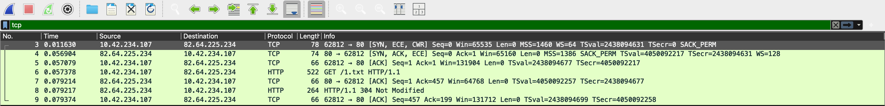
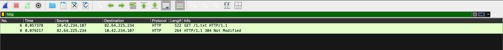
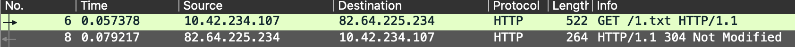

# TP 1 : Client-Serveur avec HTTP
_Auteur_ : Louis BRUNET-LECOMTE  
_Date_ : Tue 3 Feb 2026

## 1 Analyses de trames HTTP (environs 2h)

### 1.2 Captures de trammes : 
- Une poignée de main TCP 1 (qui précède tout échange HTTP) 
 

- Une requête HTTP
 

- Une réponse HTTP
 

- Une fermeture de connexion TCP

